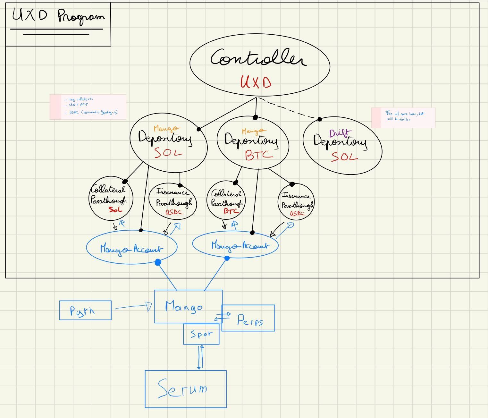
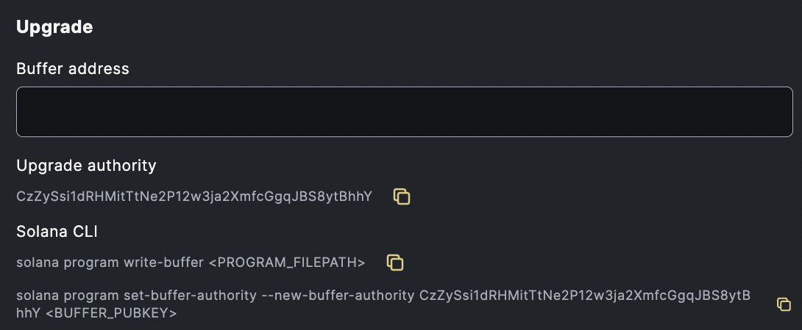

# UXD-Program

[](https://github.com/blockworks-foundation/mango-v3/actions/workflows/ci-uxd.yml)

The actual deployed state of each contract should live in a protected master branch. The latest master should always reflect the code deployed to all relevant chains

It currently sits at:

<!-- ### Solana -->
- mainnet-beta `UXD8m9cvwk4RcSxnX2HZ9VudQCEeDH6fRnB4CAP57Dr`
- devnet `882VXWftqQ9wsVq99SJqBVsz6tVeBt63jKE9XiwEHDeN` (Public version for front end)
- devnet `45oCvfmjrcJ6wEYRcWdaV14qHgtpJPES5SUfRdGD2Kc8` (Used by CI, this address should be update accordingly in ci files)

_____

## Where to start?

In this readme, you can skip to Program Architecture section, or directly go to the lib.rs file to see the code comments (about each instruction and it's inputs).
If you want to learn more about the high level concept of UXDProtocol, the [UXDProtocol Git book](https://docs.uxd.fi/uxdprotocol/) is available.

_____

## Known shortcomings

### Composability risk with MangoMarkets (and DEX in general)

As we are built on top of DEXes, we are vulnerable to them changing code or behavior. As such, we have our unit test / ci running on their repositories.
In the future we will try to implement a place perp order v2 to return the order book exploration logic back to the mango repository. [PR on Mango Market](https://github.com/blockworks-foundation/mango-v3/pull/124)

### Rebalancing (lite for now)

Current rebalancing is a bit convoluted, but we are limited computing wise and # of input account wise, as it needs to be an atomic instruction.
Later on it won't requires any external input (except to pay for fees in order to keep the system closed).

### Slippage and limit price

Currently we only take the slippage as parameter, and we execute at market price +/- slippage at the time of execution of the instruction.
This can be fixed easily and is planned, but other items were prioritized, will probably make it in a next minor release right after v3.0.0)

_____

## Running tests

### Rust unit tests

```Zsh
$> cargo test && cargo build-bpf && cargo test-bpf 
```

### E2E Tests

In order to have the environment ready to host test, the mango market devnet must be running as expected. To do so we must run market making bots and the Keeper, from [MangoClientV3](https://github.com/blockworks-foundation/mango-client-v3) repo.
Keep does the cranking (settle orders), and MM bots ensure that the order book is coherent. (Although sometimes it's still not coherent, as anyone can mess with it)

When test are failing due to odd reasons, first thing to do is to check the [MangoMarkets V3](https://devnet.mango.markets/?name=SOL-PERP) related perp (here for SOL-PERP). Verify that the order book is not borked with a weird stuck order or that the oracle price is not far away from the perp price for some reason.

```Zsh
$> GROUP=devnet.2 CLUSTER=devnet KEYPAIR=$(cat /Users/acamill/.config/solana/id.json) yarn keeper 
$> GROUP=devnet.2 CLUSTER=devnet KEYPAIR=$(cat /Users/acamill/.config/solana/id.json) MANGO_ACCOUNT_PUBKEY=8fbL4156uoVYYyY9cvA6hVBBTdui9356tdKmFbkC6t6w MARKET=SOL yarn mm # in a https://github.com/blockworks-foundation/mango-client-v3 repo to run the Market Making bot
$> GROUP=devnet.2 CLUSTER=devnet KEYPAIR=$(cat /Users/acamill/.config/solana/id.json) MANGO_ACCOUNT_PUBKEY=8fbL4156uoVYYyY9cvA6hVBBTdui9356tdKmFbkC6t6w MARKET=BTC yarn mm
$> GROUP=devnet.2 CLUSTER=devnet KEYPAIR=$(cat /Users/acamill/.config/solana/id.json) MANGO_ACCOUNT_PUBKEY=8fbL4156uoVYYyY9cvA6hVBBTdui9356tdKmFbkC6t6w MARKET=ETH yarn mm
```

Once this is setup, in another terminal you can build, deploy and run the test :

```Zsh
$> ./scripts/reset_program_id.sh # Optional, will reset the program ID in all files where it's needed to start with a clean slate
$> anchor test # Will build, deploy and run the tests
```

If you want to re-run the tests with the already deployed program (without registering changes to the rust code), you can run :

```Zsh
$> anchor test --skip-build --skip-deploy
```

If you made changes to the Rust code, you have to re-run the lengthy :

```Zsh
$> anchor test
```

Loop theses as many time as you want, and if you want a clean slate, just reset the program_id with the script again.

_____

## Codebase org

The program is contained in `programs/uxd/`.
Its instructions are in `programs/uxd/src/instructions/`.

The project follows the code org as done in [Jet protocol](https://github.com/jet-lab/jet-v1) codebase.

The project uses `Anchor` for safety, maintainability and readability.

The project relies on `Mango Markets` [program](https://github.com/blockworks-foundation/mango-v3), a decentralized derivative exchange platform build on Solana, and controlled by a DAO.

This program contains 2 set of instructions, one permissionned and one permissionless

_____

## Program Architecture



The initial state is initialized through calling `initializeController`, from there a mint is created for Redeemable, the signer is kept as the administrative authority, and that's it.

It owns the Redeemable Mint currently. In the future there could be added instruction to transfer Authority/Mint to another program due to migration, if needs be.

```Rust
#[account]
#[derive(Default)]
pub struct Controller {
    pub bump: u8,
    pub redeemable_mint_bump: u8,
    // Version used
    pub version: u8,
    // The account with authority over the UXD stack
    pub authority: Pubkey,
    pub redeemable_mint: Pubkey,
    pub redeemable_mint_decimals: u8,
    //
    // The Mango Depositories registered with this Controller
    pub registered_mango_depositories: [Pubkey; 8], //  - IDL bug with constant, so hard 8 literal. -- Still not working in 0.20.0 although it should
    pub registered_mango_depositories_count: u8,
    //
    // Progressive roll out and safety ----------
    //
    // The total amount of UXD that can be in circulation, variable
    //  in redeemable Redeemable Native Amount (careful, usually Mint express this in full token, UI amount, u64)
    pub redeemable_global_supply_cap: u128,
    //
    // The max amount of Redeemable affected by Mint and Redeem operations on `MangoDepository` instances, variable
    //  in redeemable Redeemable Native Amount
    pub mango_depositories_redeemable_soft_cap: u64,
    //
    // Accounting -------------------------------
    //
    // The actual circulating supply of Redeemable
    // This should always be equal to the sum of all Depositories' `redeemable_amount_under_management`
    //  in redeemable Redeemable Native Amount
    pub redeemable_circulating_supply: u128,
    //
    // Note : This is the last thing I'm working on and I would love some guidance from the audit. Anchor doesn't seems to play nice with padding
    pub _reserved: ControllerPadding,
}
```

The `authority` (admin) must then register some `Depository`/ies by calling `register_depository`.
One State is tied to many `Depository` accounts, each of them being a vault for a given Collateral Mint.

```Rust
#[account]
#[derive(Default)]
pub struct MangoDepository {
    pub bump: u8,
    pub collateral_passthrough_bump: u8,
    pub insurance_passthrough_bump: u8,
    pub mango_account_bump: u8,
    // Version used
    pub version: u8,
    pub collateral_mint: Pubkey,
    pub collateral_mint_decimals: u8,
    pub collateral_passthrough: Pubkey,
    pub insurance_mint: Pubkey,
    pub insurance_passthrough: Pubkey,
    pub insurance_mint_decimals: u8,
    pub mango_account: Pubkey,
    //
    // The Controller instance for which this Depository works for
    pub controller: Pubkey,
    //
    // Accounting -------------------------------
    // Note : To keep track of the in and out of a depository
    //
    // The amount of USDC InsuranceFund deposited/withdrawn by Authority on the underlying Mango Account - The actual amount might be lower/higher depending of funding rate changes
    // In Collateral native units
    pub insurance_amount_deposited: u128,
    //
    // The amount of collateral deposited by users to mint UXD
    // Updated after each mint/redeem
    // In Collateral native units
    pub collateral_amount_deposited: u128,
    //
    // The amount of delta neutral position that is backing circulating redeemable.
    // Updated after each mint/redeem
    // In Redeemable native units
    pub redeemable_amount_under_management: u128,
    //
    // The amount of taker fee paid in quote while placing perp orders
    pub total_amount_paid_taker_fee: u128,
    //
    pub _reserved: u8,
    //
    // This information is shared by all the Depositories, and as such would have been a good
    // candidate for the Controller, but we will lack space in the controller sooner than here.
    //
    // v2 -83 bytes
    pub quote_passthrough_bump: u8,
    pub quote_mint: Pubkey,
    pub quote_passthrough: Pubkey,
    pub quote_mint_decimals: u8,
    //
    // The amount of DN position that has been rebalanced (in quote native units)
    pub total_amount_rebalanced: u128,
    //
    pub _reserved1: MangoDepositoryPadding,
}
```

Each `Depository` is used to `mint()` and `redeem()` Redeemable tokens with a specific collateral mint, and to do so each instantiate a Mango PDA that is used to deposit/withdraw collateral to mango and open/close short perp.

## Admin instructions

They setup the UXD account stack and provide access to the settings.
Only the `authority` set in the `Controller` can interact with these instructions.

### `Initialize`

This initialize the State of the program by instantiating a `Controller`. Called once, the signer becomes the authority, will be done through the DAO.
Only one controller can exist at anytime.

### `RegisterMangoDepository`

Instantiate a new `MangoDepository` PDA for a given collateral mint.
A depository is a vault in charge a Collateral type, the associated mango account and insurance fund.

### `DepositInsuranceToMangoDepository` / `WithdrawInsuranceFromMangoDepository`

Withdraw need to be specific cause it's PDA own accounts.

This would be used to add USDC to a depository mango account to fund it's insurance fund in UXD case.

### `setRedeemableGlobalSupplyCap`

Change the value of the global supply cap (virtual, not on the mint) for the Redeemable by the Controller.

### `setMangoDepositoriesRedeemableSoftCap`

Change the value of the Mango Depositories operations (Mint/Redeem) Redeemable cap, prevent minting/redeeming over this limit.

## User instructions

They allow end users to mint and redeem redeemable tokens, they are permissionless.

### `mint_uxd`

Send collateral to the `Depository` taking that given mint
Estimate how much fill we can get to know how much collateral need to be actually deposited to mango to improve efficiency
Open equivalent perp position (FoK with the provided slippage)
Check that the position was fully opened else abort
Deduct perp opening fees from the quote amount
Mint equivalent amount of UXD to user (as the value of the short perp - taker fees)

### `redeem_uxd`

User send an amount of UXD to a given `Depository`
We calculate how much collateral that's worth, provided the user slippage and the perp price from Mango
We create a Perp Short Close FoK order in that range
We check that it got filled 100%
We calculate how much USDC value that was, deduct fees
We burn the same value of UXD from what the user sent
We withdraw the collateral amount equivalent to the perp short that has been closed previously (post taxes calculation)
We send that back to the user (and his remaining UXD are back too, if any)

### `RebalanceMangoDepositoryLite`

Convert any paper profits from the short perp part of the delta neutral position back into the delta neutral position, either increasing or decreasing it's size.

If the PnL is positive, profits are used to buy more spot collateral and an equivalent amount of short perp is opened.
If the PnL is negative, some collateral is sold spot, and the equivalent amount of short perp is closed.

Currently it's the lite version, because we cannot do all this atomically in 200k computing nor with 34~ accounts on mango markets. (~34 is the best when we implement place_perp_order_v2).
In order to circumvent this limitation, we skip the spot part by send QUOTE or COLLATERAL (and returning the resulting COLLATERAL or QUOTE). It acts as a swap for taker fees + slippage.

It is open as it won't fit a the nested instruction space of DAO proposal (we might also incentivize rebalancing with UXP rewards at some point or find a decentralized way to keep the PnL in check).

_____

## Testing strategy with CI

There are a few script in the test folder with following the `test_ci_*.ts`, these are related to the github workflow.
It's quite unstable to test on devnet with typescript, and expect MangoMarkets order book to be consistent, but it somehow works.

The CI strategy for E2E :

- use the ci-resident-program (``) (call ./scripts/swap_ci_resident_program.sh)
- use it's upgrade authority stored in `target/deploy/ci-resident-upgrade-authority.json` for deployment
- upgrade program
- run the market making bots
- then starts X testing suites in parallel for each Collateral/Dex whatever case (for now on mango and later on more with new Dexes).

Note that it don't do concurrent run of this workflow, as they test some internal state of the program and would collide.

The CI also runs cargo fmt, clippy, test and test-bpf.

Cargo audit and Soteria (automated auditing tool) are run on main branch merges.

_____

## Deployment and Program Upgrades

By default the program builds with the `development` feature, and the ProgramID for devnet.

Building for mainnet uses `anchor build -- --no-default-features --features production`

The program upgrade are done through our [DAO](https://governance.uxd.fi/dao/UXP).

It required to build for release then to prepare a buffer with :

```Zsh
$> solana program write-buffer  ./target/deploy/uxd.so 
# anchor verify -p uxd <Buffer ID from previous command>  //TODO
$> solana program set-buffer-authority <BufferID> --new-buffer-authority CzZySsi1dRHMitTtNe2P12w3ja2XmfcGgqJBS8ytBhhY
```


