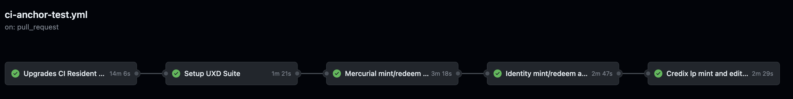

# UXD-Program

[](https://github.com/UXDProtocol/uxd-program/actions/workflows/ci-anchor-test.yml)
[](https://github.com/UXDProtocol/uxd-program/actions/workflows/ci-cargo-lint-test.yml)
[](https://github.com/UXDProtocol/uxd-program/actions/workflows/ci-soteria-audit.yml)
[](https://github.com/UXDProtocol/uxd-program/actions/workflows/ci-cargo-audit.yml)

## Disclaimer

**This branch contains a version of the UXD Program altered for hackathon to ease integration. Devnet ONLY.**

---

The actual deployed state of each contract should live in a protected master branch. The latest master should always reflect the code deployed to all relevant chains

It currently sits at:

<!-- ### Solana -->

- mainnet-beta `UXD8m9cvwk4RcSxnX2HZ9VudQCEeDH6fRnB4CAP57Dr`

- devnet `55NneSZjuFv6cVDQxYKZ1UF99JoximnzP9aY65fJ4JT9` (Used by CI, this address should be update accordingly in ci files)

## Getting start

If you want to learn more about the high level concept of UXDProtocol, the [UXDProtocol Git book](https://docs.uxd.fi/uxdprotocol/) is available.

## Codebase org

The program (smart contract) is contained in `programs/uxd/`.
Its instructions are in `programs/uxd/src/instructions/`.

The project follows the code org as done in [Jet protocol](https://github.com/jet-lab/jet-v1) codebase.

The project uses `Anchor` for safety, maintainability and readability.

This program contains 2 set of instructions, one permissionned and one permissionless. Permissionned instruction are called by [our DAO](https://governance.uxd.fi/dao/UXP).

Please refer to the [UXDProgram Git book](https://docs.uxd.fi/uxdprogram-solana/welcome/purpose-and-philosophy) for the program architecture.

## Interaction with UXD Client

[UXD Client](https://github.com/UXDProtocol/uxd-client) is the open source typescript client of UXD Program.

Each version of program is expected to pair with a specific version of the client, so any enhancement to the program that change the IDL must have a corresponding update on the client as well.

To run the integration test with a specific client, please specify the version of `@uxd-protocol/uxd-client` in the `package.json` file.

To test locally with local client modification, `npm link` can be used as described below:

```Zsh
# on the client directory
$> npm link
# then run cmd below on the program directory to link the locally build package instead of the fetched one
$> npm link @uxd-protocol/uxd-client
```

## Audits

The Program has been audited by Bramah Systems and Sec3.dev (previously Soteria) three times in the past.
It is currently under continuous audit by Sec3.dev.

Audit reports are available at <https://docs.uxd.fi/uxdprogram-solana/welcome/audits>.

## Running tests

### Rust unit tests

```Zsh
$> cargo test && cargo build-bpf && cargo test-bpf
```

### E2E Tests

Run the test :

```Zsh
$> ./scripts/reset_program_id.sh # Optional, will reset the program ID in all files where it's needed to start with a clean slate
$> anchor test # Will build, deploy and run the tests
```

If you want to re-run the tests with the already deployed program (without registering changes to the rust code), you can run :

```Zsh
$> anchor test --skip-build --skip-deploy
```

If you made changes to the Rust code, you have to re-run the lengthy :

```Zsh
$> anchor test
```

Loop theses as many time as you want, and if you want a clean slate, just reset the program_id with the script (`./script/reset_program_id.sh`).

## Testing strategy with CI

Four workflow would be kick started for PR branches merging to `main`.

### Anchor test - ci-anchor-test.yml

E2E test.
There are a few script in the test folder with following the `test_ci_*.ts`, these are related to the github workflow.

The CI strategy for E2E :

- use the ci-resident-program (call ./scripts/swap_ci_resident_program.sh)
- use it's upgrade authority stored in `target/deploy/ci-resident-upgrade-authority.json` for deployment
- upgrade program
- start `test_ci_setup.ts`, to setup controller and all depositories on the resident program, no mint/redeem testing is involved on this test suite, global settings like supply cap and insurance fund should be tested here.
- then starts test suites in series for each depositories.
- here is the job dependencies
  

Note that it don't do concurrent run of this workflow, as they test some internal state of the program and would collide.

### Cargo audit test - ci-cargo-audit.yml

Crates security vulnerability checking [tool](https://github.com/RustSec/rustsec/tree/main/cargo-audit), by RustSec.

### Cargo lint test - ci-lint-test.yml

Runs cargo fmt, clippy, test and test-bpf.

### Soteria audit test - ci-soteria-audit.yml

Solana smart contract vulnerability scanning [tool](https://github.com/silas-x/soteria-action), by Soteria.

## Branches and Tags

Branch off from `main` for new development changes. Pull requests should always target to `main` as well.

After passing the continuous audit by Sec3.dev, program would get deployed and merged to `main` and tagged with the version name as `v*.*.*`.

Check the [Releases](https://github.com/UXDProtocol/uxd-program/releases) for previous deployed program on mainnet.

## Deployment and Program Upgrades

By default the program builds with the `development` feature, and the ProgramID for devnet.

Building for mainnet uses `anchor build -- --no-default-features --features production`

The program upgrade are done through our [DAO](https://governance.uxd.fi/dao/UXP).

It required to build for release then to prepare a buffer with :

```Zsh
$> solana program write-buffer  ./target/deploy/uxd.so
# anchor verify -p uxd <Buffer ID from previous command>  //TODO
$> solana program set-buffer-authority <BufferID> --new-buffer-authority CzZySsi1dRHMitTtNe2P12w3ja2XmfcGgqJBS8ytBhhY
```


## Licensing

The license for UXD Program is the Business Source License 1.1 (`BUSL-1.1`), see [`LICENSE`](./LICENSE).
